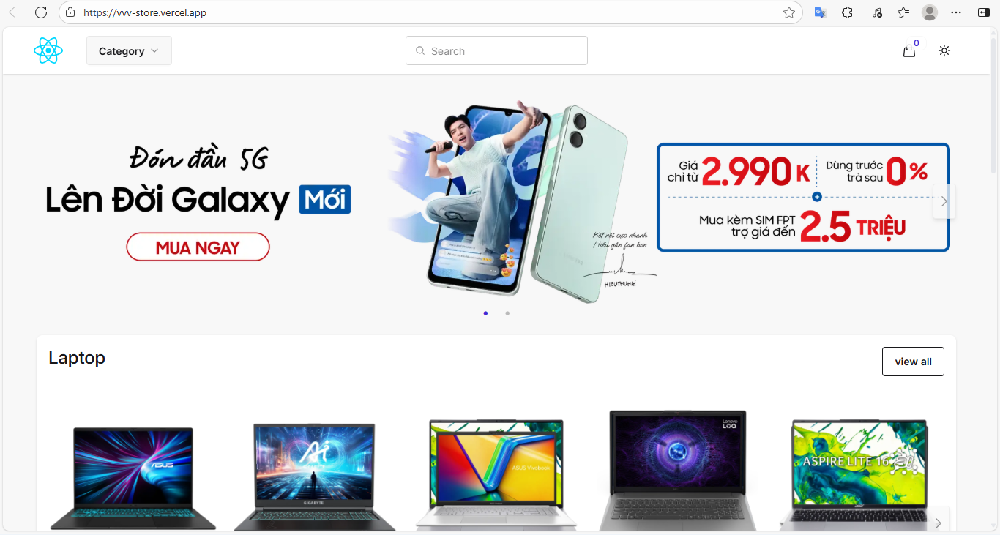
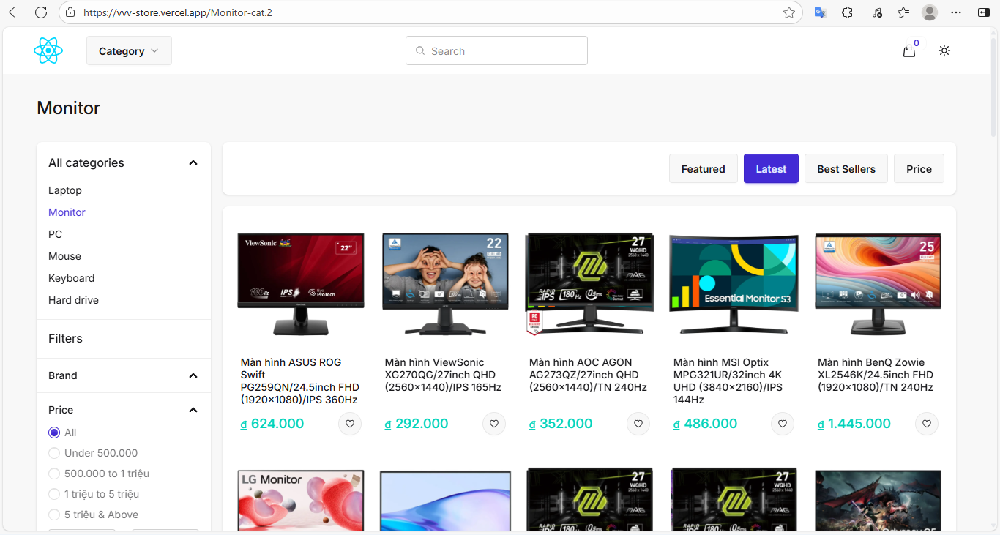
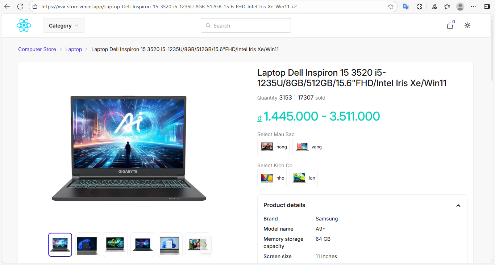
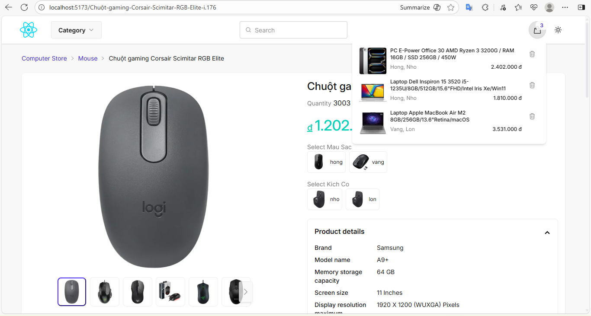
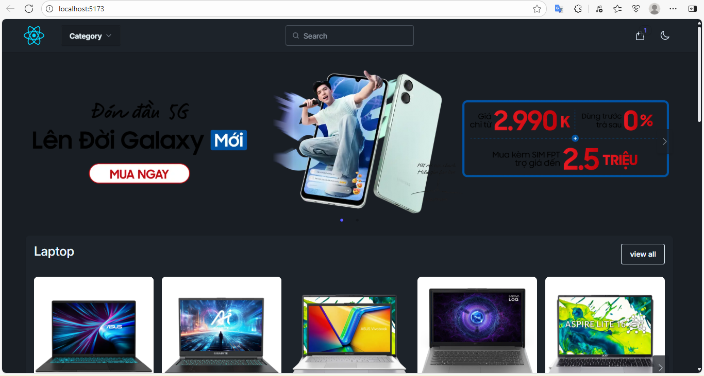

# VVV Store
Hosted at https://vvv-store.vercel.app

This is an e-commerce website designed for selling electronic products. It features a modern and user-friendly interface, making it easy for customers to browse and explore items. However, since this is only a demonstration project, some essential features still need to be added before it can be used in a real-world environment.

## Tech Stacks
**Frontend**: ReactJS, TypeScript, Tailwind CSS, daisyUI

**Backend**: NestJS, MySQL, Cloudinary

## Demo
As you can see, a list of products is shown here. They are organized into categories. You can search, sort, filter products, add them to your cart, and more.

| Homepage |
|----------|
|  |

| Category Page |
|---------------|
|  |

| Product Details |
|-----------------|
|  |

| Cart |
|------|
|  |

Moreover, you can browse the website in dark mode.

| Dark Mode |
|-----------|
|  |
